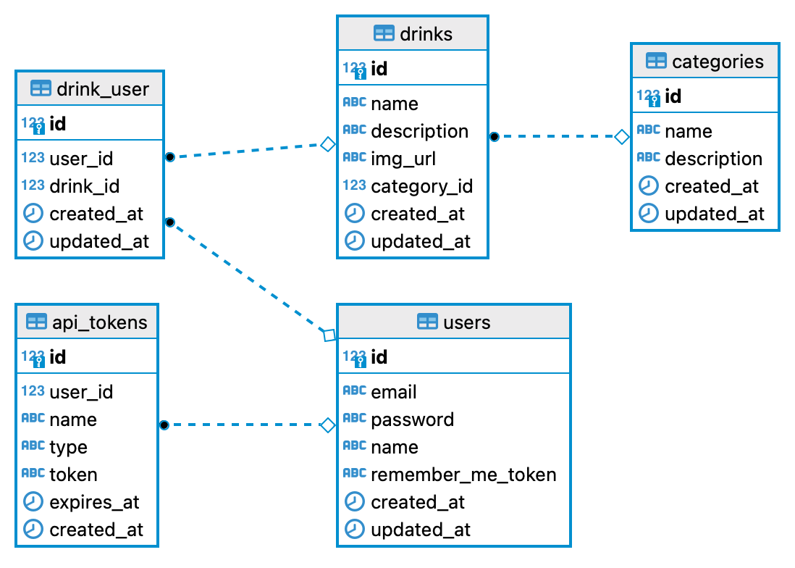

# Drinks Backend

Projeto de um sistema onde o usuário pode visualizar bebidas e criar favoritos.

Nesse sistema o usuário pode:

- Visualizar uma lista de categoritas de bebidas;
- Clicar em uma categoria e visualizar as bebidas dentro dessa categoria;
- Pesquisar por bebidas;
- Fazer login e favoritar bebidas;
- Visualizar seus favoritos;

## Tecnologias

- Adonis 5
- PostgreSQL
- Typescript
- Swagger

## Setup

Requisitos:

- Docker
- Docker Compose
- Node

Se for a primeira vez que estiver rodando o projeto, rode o seguinte comando
para instalar as dependências, rodar as migrations e popular o banco de dados antes de subir o servidor:

```bash
make build
```

Se já tiver realizado o build da aplicação e desejar apenas subir o servidor, rode o seguinte comando:

```bash
make serve
```

Para encerrar o servidor:

```bash
make stop
```

Se desejar subir o servidor em modo watch: 

```bash
make watch
```

## Rotas

|Método HTTP | Endpoint | Exige autenticação? |
|---|---|---|
|POST        | /api/v1/auth/register | Não
|POST        | /api/v1/auth/login | Não
|GET         | /api/v1/categories | Não
|GET         | /api/v1/categories/:id | Não
|GET         | /api/v1/categories/:categoryId/drinks | Não
|GET         | /api/v1/drinks | Não
|GET         | /api/v1/drinks/:id | Não
|GET         | /api/v1/auth/current-user | Sim
|GET         | /api/v1/favorites | Sim
|POST        | /api/v1/favorites | Sim
|DELETE      | /api/v1/favorites/:id | Sim

Para visualizar a documentação da API no Swagger, suba o servidor da aplicação e entre no endereço [http://localhost:3333/docs](http://localhost:3333/docs)

## Banco de Dados

Diagrama das tabelas do banco:


